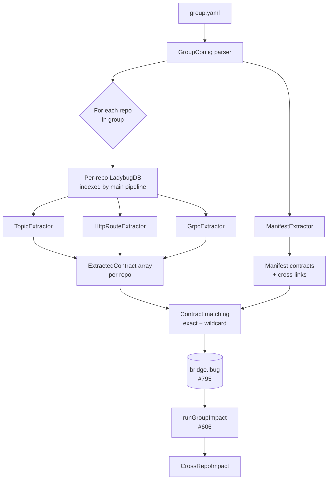
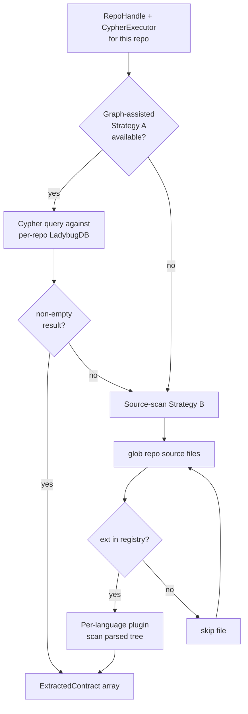
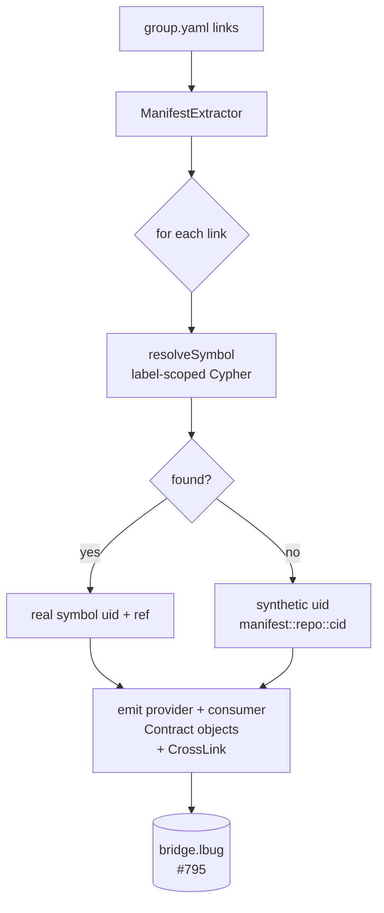
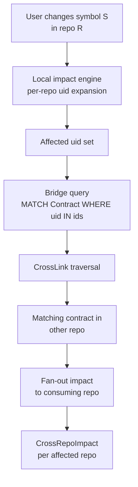
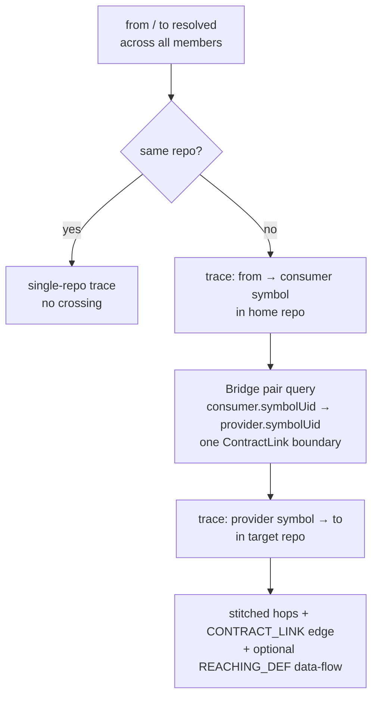

# Group Analysis Pipeline

Flow chart of the cross-repo contract extraction + matching pipeline.
This covers what runs **inside this PR** (extractors + manifest) and
the downstream handoff to the bridge storage (PR #795) and
cross-impact query (PR #606).

## High-level overview



## Per-repo extractor pipeline

Each extractor under `src/core/group/extractors/` follows the same
two-strategy shape:



**Strategy A** (graph-assisted) uses Cypher over edges already produced
by the main ingestion pipeline:
- HTTP: `HANDLES_ROUTE` / `FETCHES` edges from `(File)-[]->(Route)`
- topic: none (pipeline doesn't yet produce topic nodes — Strategy B only)
- gRPC: none (Strategy B + proto map only)

**Strategy B** (source-scan) is 100% tree-sitter based after this PR.
Each `*-patterns/<lang>.ts` plugin owns its grammar + S-expression
queries; the top-level orchestrator imports neither.

## Plugin architecture

```mermaid
flowchart LR
  O[Orchestrator<br/>topic|http|grpc-extractor.ts] --> REG[REGISTRY<br/>*-patterns/index.ts]
  REG --> P1[java.ts<br/>tree-sitter-java]
  REG --> P2[go.ts<br/>tree-sitter-go]
  REG --> P3[python.ts<br/>tree-sitter-python]
  REG --> P4[node.ts<br/>JS + TS + TSX]
  REG --> P5[php.ts<br/>tree-sitter-php<br/>HTTP only]
  REG --> P6[proto.ts<br/>tree-sitter-proto<br/>gRPC only, optional]

  P1 --> SCAN[tree-sitter-scanner.ts<br/>compilePatterns + runCompiledPatterns]
  P2 --> SCAN
  P3 --> SCAN
  P4 --> SCAN
  P5 --> SCAN
  P6 --> SCAN

  SCAN --> DET[Detection objects<br/>TopicMeta / HttpDetection / GrpcDetection]
  DET --> O
  O --> CT[ExtractedContract array]
```

The orchestrator never imports a grammar. Adding a new language /
framework = drop one file in `*-patterns/`, register it in
`index.ts`. No orchestrator edits required.

## Manifest extraction



Label-scoped queries in `resolveSymbol` keep accidental cross-matches out.
They use the `MATCH (n) WHERE labels(n) IN [...]` allowlist form, NOT the
`MATCH (n:A|B)` disjunction — LadybugDB's parser rejects a disjunction that
names a reserved keyword (e.g. `Macro`, `Union`), which is what broke the
`custom` branch in #2325:
- `topic` → `labels(n) IN ['Function','Method','Class','Interface']`
- `grpc`/`thrift` method → `labels(n) IN ['Function','Method']`, service → `labels(n) IN ['Class','Interface']`
- `lib` → `labels(n) IN ['Module']`

## Cross-impact query (PR #606)



The bridge stores every extracted contract keyed by `symbolUid`.
Manifest-sourced contracts use the synthetic uid form so both sides
of the `(local impact) ↔ (bridge query)` join derive the same uid
without coordinating through any shared state.

## Cross-repo trace (`cross-trace.ts`)

A second consumer of the bridge. Where cross-impact fans a blast radius
*outward* from one symbol, cross-trace stitches a directed **path** between
two symbols that live in different repos:



It reuses the same `symbolUid` join as cross-impact, but issues its own
*pair* query (`listCrossingsBetween`) because a path needs BOTH endpoints of
a crossing — the uid-filtered neighbor join (`resolveBridgeNeighbors`, shared
with impact) returns only the far side. The crossing is clamped to one
boundary (`MAX_SUPPORTED_CROSS_DEPTH`). With `pdg: true` the boundary-adjacent
segments are enriched with intra-procedural REACHING_DEF data-flow (never
across the boundary). Full cross-program data flow across the boundary is a
deferred follow-up.
